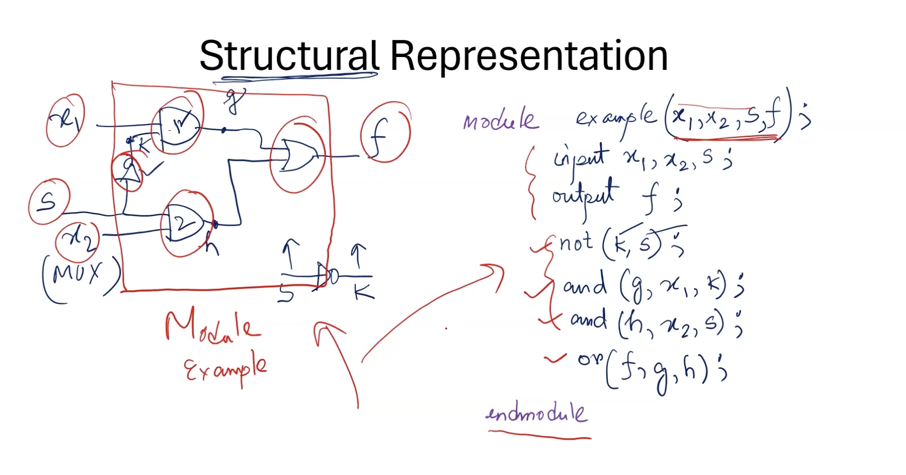
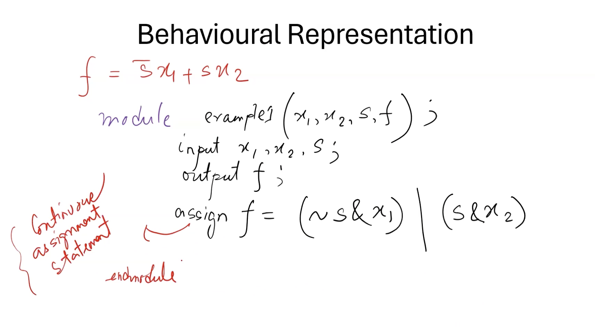

#HDL

Two types

1. system verilog
2. VHDL

we will write code is system verilog

### Module

- block of hardware with inputs and outputs
- it preforms a specific function
- Examples: AND gate, MUX, priority encoder, adder

---

### Module block

##### module <br/> module_name(list of ports)
- input/output declarations;
- Local net decalarations;
- paralell statements;

##### endmodule

---

### comments

```
//
/* ... */
```

---

### operators
```
&   //and
|   //or
~   //not
```

---

###  Module functionality

1. Structural representation
- and(y,x1,x2)

- in terms of logic gates


2. Behavioral
- assign y = x1 & x2

- in terms of logical expressions


