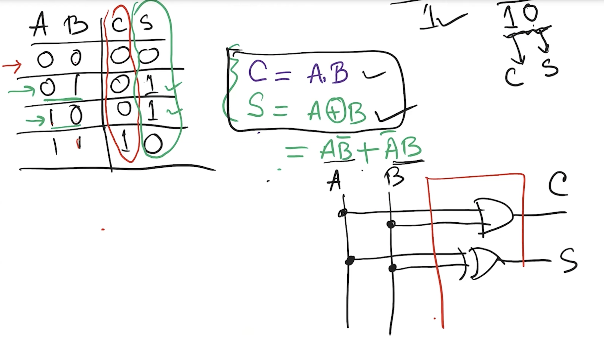

#Adders

---

### A simple 1 bit adder
carry bit is like an and gate.

sum bit is like an XOR

---

## Multi-bit adders

---

### 4 bit adder

2 4 bit numbers:

$A = A_3,A_2,A_1,A_0$

$B = B_3,B_2,B_1,B_0$

the sum:

if the numbers were: $A=1111, \ B=0001$

the 1 in $B_0$ would cascase across 1 until it is $10000$

From the 0 position, the first carry which is added to position 1, is called $C_0$ 
