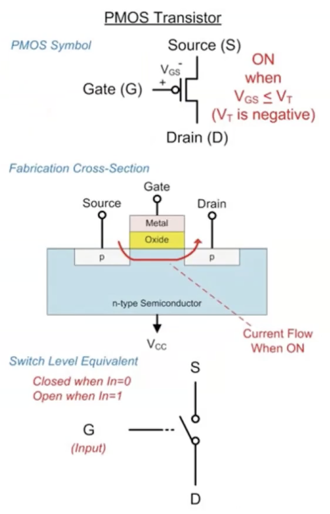

# Logic circuits

A logic circuit is composed of:

- inputs
- outputs

Function specifications: relationship of inputs and outputs; mapping

Timing specifications: delay between input changes and output responses

---

A switch between $A$ and $B$ is controlled through input $X$

For two switches in series, they must bothe be on $\equiv X_1 \cdot X_2 \equiv \quad AND$

Two switches in parallel: $X_1+X_2\equiv\quad OR$   

for an OR gate in series with an AND gate: $(X_1+X_2)\cdot X_3$

---

## Types of logic circuits

#### Combinational logic

- memoryleses; output depends on current input
- does not depend on previous history of operations
$y(t)=x(t)$
#### Sequential logic

- has memory
- Outputs determine by previous and current values
- sequential logic has Combinational logic within it
$y(t)=x(t) \ and \ x(t-1)$

---


XOR gate diagram

---

```
        __________
       |          |
a ---> |          |---> (C)arry
       |  ADDER   |
b ---> |          |---> (S)um
       |__________|
```

$0+0=0 \Longrightarrow \quad C=0, \ S=0$
$0+1=1 \Longrightarrow \quad C=0, \ S=1$
$1+1=1 \Longrightarrow \quad C=1, \ S=1$


$$
\begin{array}{|c c|c c|}
  \hline
a & b & C & S\\
\hline
0 & 0 & 0 & 0\\
0 & 1 & 0 & 1\\
1 & 0 & 0 & 1\\
1 & 1 & 1 & 1\\
\hline
\end{array}
$$

The carry bit represents an AND gate, and the sum bit is an XOR gate.

---

# CMOS logic gates

what is under the logic abstraction?

MOS: Metal Oxide Semiconductor

Many MOS transistors can be combined to make logic gates

applying voltage to the gate turns transistor on

### Two types of MOS transistors

1. NMOS


- when gate is 0, transistor is off
- when gate is 1, transistor is on

2. PMOS



- when gate is 1, transistor is off
- when gate is 0, transistor is on

Combining NMOS and PMOS makes a CMOS gate

NAND is less complex than AND gate and NOR is less complex than OR.
