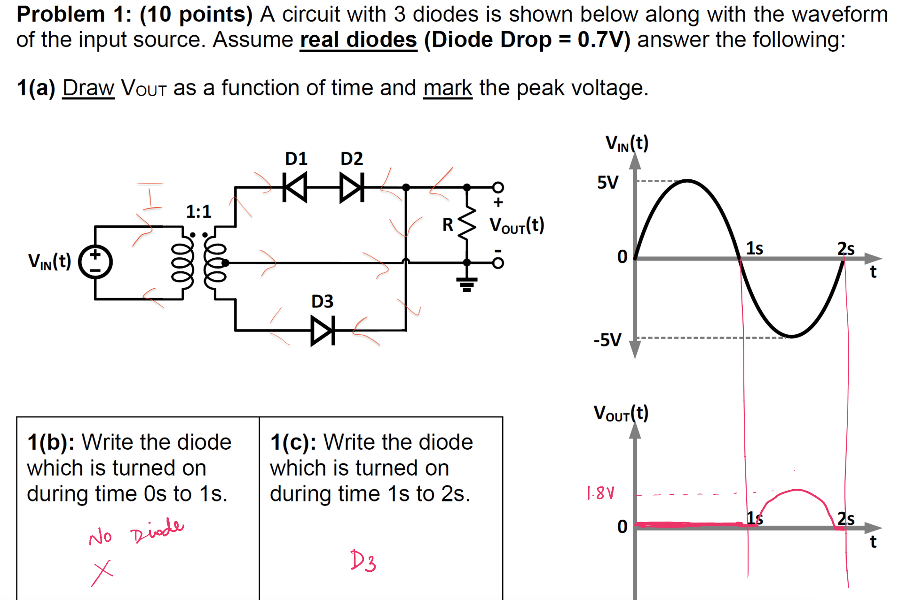
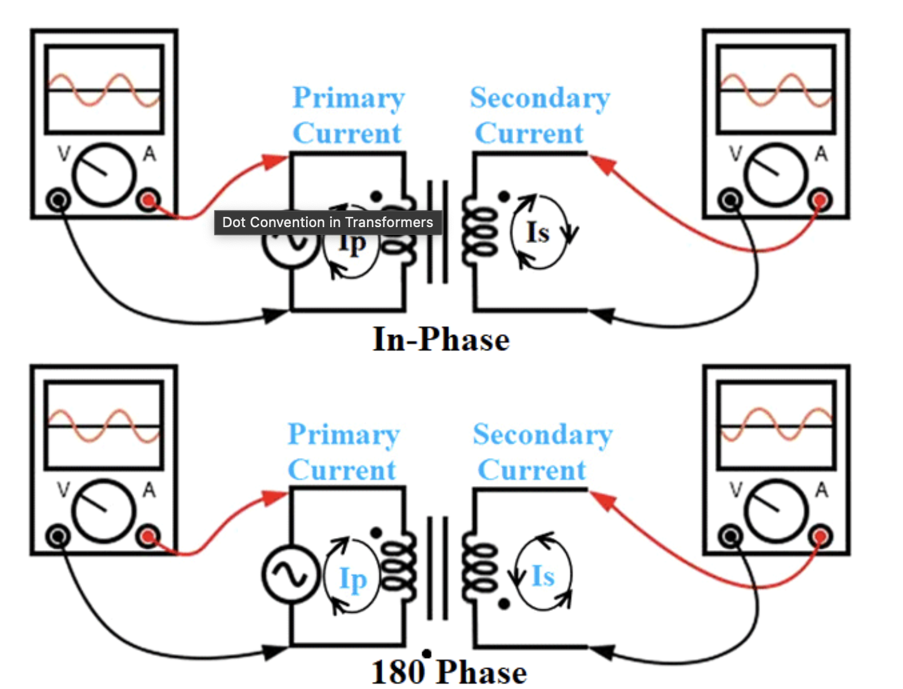
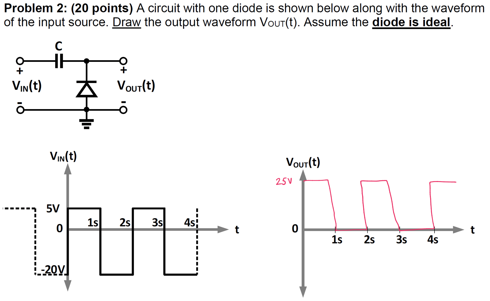

## Problem 1:

Transformer:
Center-tap halves the voltage.

Dot convention:

when input is positive, primary runs clockwise and secondary is also clockwise.
$\therefore$ positive current is blocked by D1 on the top half of CT, and the bottom hald is blocked by D3

---
 
## Problem 2

When the volatge is negative, the forward biased diode shorts the output. Meanwhile, it charges the capacitor with 20v

When the voltage is positive the diode is ignored and the power supply's 5v combines with the 20v sotred in the capacitor. the reverse biased diode blocks that path to ground and all the power goes tto the output.

