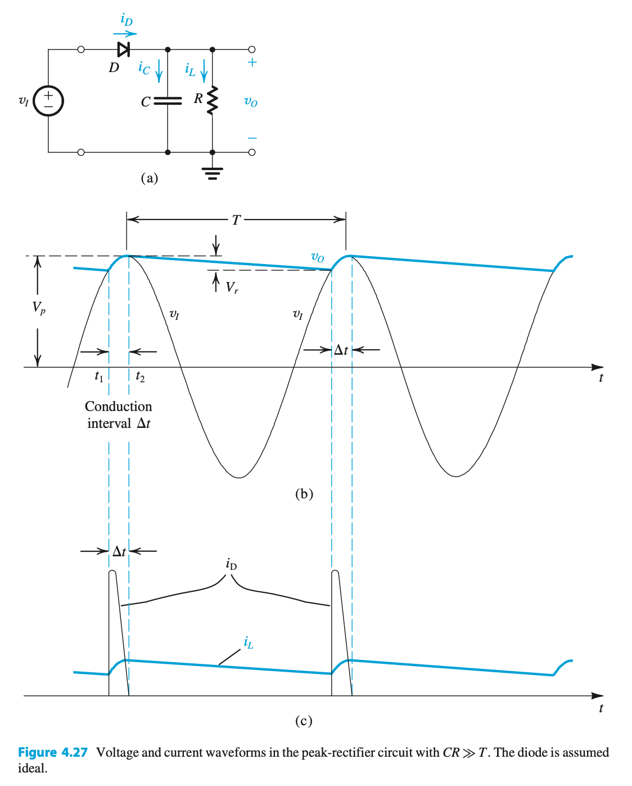
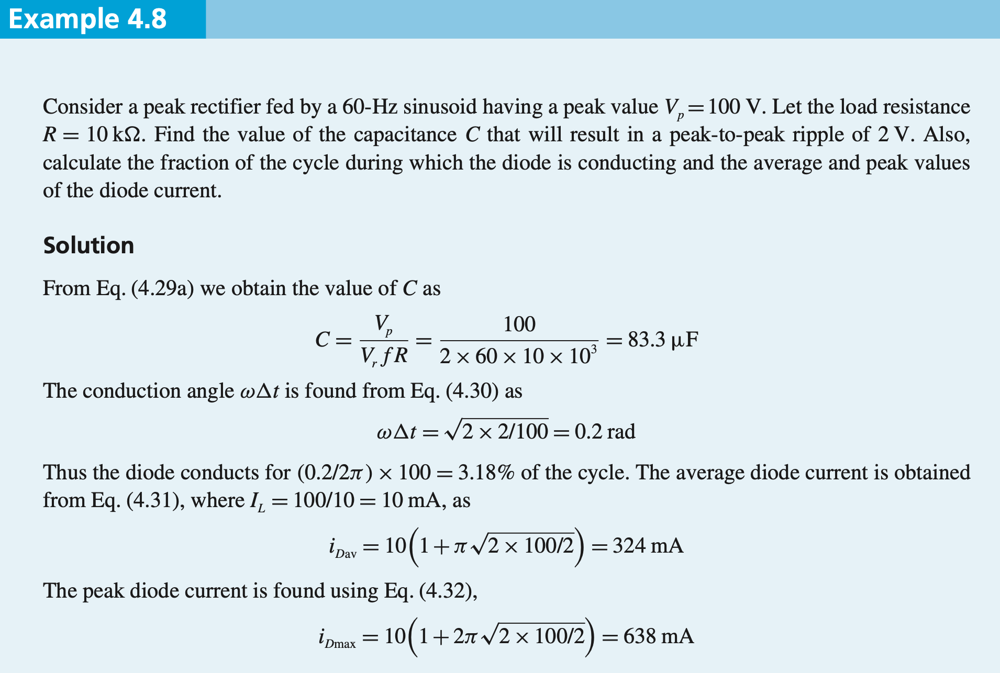

## Half wave rectifier with a filter capacitor

Rectified AC becomes a bumpy pulse of positive voltage potential

To stabilize it, a filter capacitor fills out the dead spots in the middle

The capacitor is a reactiv load placed after a diode which is forward biased while input in positive

| **Symbol**  |   **Definition**                        |
| :---    | :---                                |
| $V_I$   | Input voltage |
| $i_D$   | Current through diode |
| $i_C$   | Current throught capacitor  |
| $i_L$   | ==AC== current through load  |
| $I_L$   | ==DC== current through load  |
| D, C, R | Diode, cap, resisor |
| $V_o$   | Voltage out |
| $V_p$   | Peak input voltage |
| $t_1,t_2$ | period of diode conduction |
| $\Delta t$ | period of diode conduction |
| $T$     | Period of input sine wave |
| $V_r$  | Peak to peak ripple voltage |

The current across the load is $i_L=\dfrac{v_o}{R}$

When the diode is conducting, its current is $I_D=i_C+i_L=C\cdot\dfrac{dv_I}{dt}+i_L$

The interval of the diode's conduction is $\Delta t$

Durring $\Delta t$ the short burst of power supplies the capacitor with cahrge that 

During the diode-off interval, the capacitor C discharges through R, and thus $v_o$
decays exponentially with a time constant CR.

$v_o = V_p - V_r$

 $I_L = \dfrac{V_p}{R}$

 If desired, a more accurate expression for the output dc voltage can be obtained by
taking the average of the extreme values of $v_o$:

$V_o =V_p - \frac{1}{2}V_r$

During the diode-off interval, $v_o$ can be expressed as:
$v_o=V_p\cdot e^{\frac{-t}{CR}}$

We observe that to keep $V_r$ small we must select a capacitance $C$ so that $CR$ ≫ $T$. The ripple
voltage $V_r$ can be expressed in terms of the frequency $f=\dfrac{1}{T}$ as:

$V_r=\dfrac{V_p}{f\cdot C\cdot R}$

or alternately:

$V_r=\dfrac{I_L}{f\cdot C}$

Assuming that diode conduction ceases almost at the peak of vI , we can determine the
conduction interval t from

$V_p \cdot cos(\omega\cdot t)= V_p−V_r$

where $\omega = 2\cdot \pi \cdot f \ \equiv \ \frac{2\pi}{T}$ is the angular frequency of $v_I$ . Since $(\omga\cdot t)$ is a small angle, we can
employ the approximation $\cos{(\omega\cdot t)} \approx 1−\frac{1}{2}\cdot (\omega\cdot t)^2$ to obtain:

$\omega\cdot t \approx {\displaystyle\sqrt{\frac{2V_r}{V_p}}}$

Note that when $V_r$ ≪ $V_p$, the conduction angle $\omega\cdot\Delta t$ will be small.

Average diode current during conduction, $i_{Dav}$, equate the charge that
the diode supplies to the capacitor:

$Q_{supplied}=i_{Cav}\cdot \Delta t$

where: $i_{Cav}=i_{Dav}-I_L$

durring the discharge interval:

$Q_{lost}=C\cdot V_r$

and $i_{Dav}=I_L\cdot (1+\pi \sqrt{\frac{2\cdot V_p}{V_r}})$

when $V_r$ << $V_p$, $i_{Dmax}\approx 2\cdot i_{Dav}$ because the wveform of of $i_D$ is almost a right angle.

---

## Full wave rectifier

$i_{Dav}= I_L\cdot (1 +\pi\cdot\sqrt{\frac{V_p}{2\cdot V_r}})$

$i_{Dmax}= I_L\cdot (1 + 2\cdot\pi\cdot\sqrt{\frac{V_p}{2\cdot V_r}})$

- The circuit needs a capacitor half the size of that required in the half-wave rectifier.

- The current in each diode in the full-wave rectifier is approximately half that which flows in the diode of the half-wave circuit.

