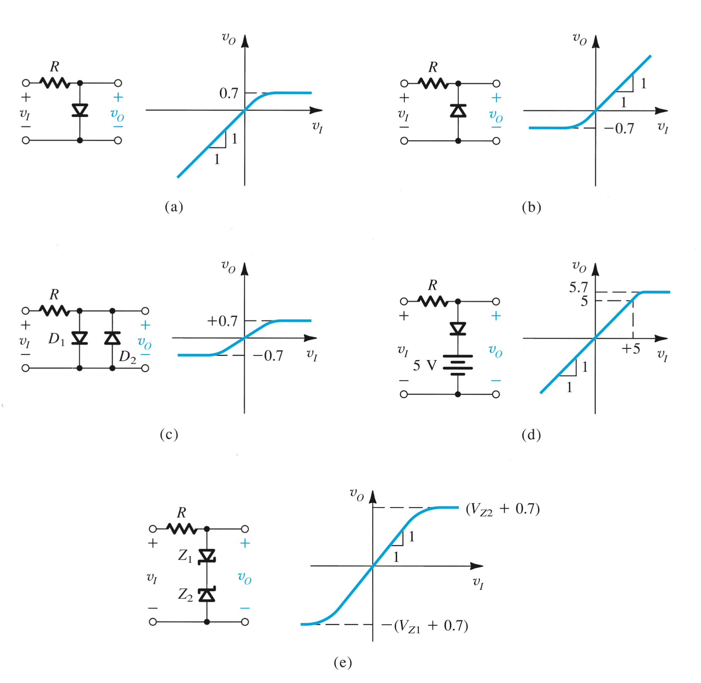
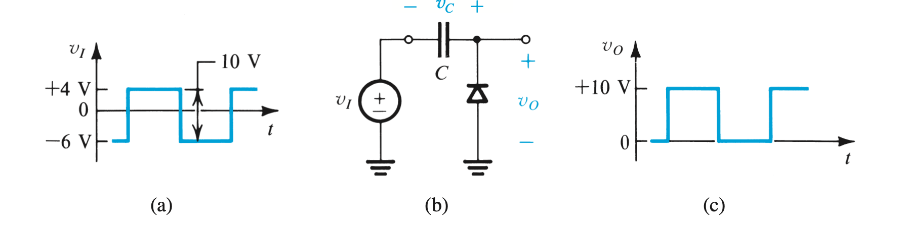
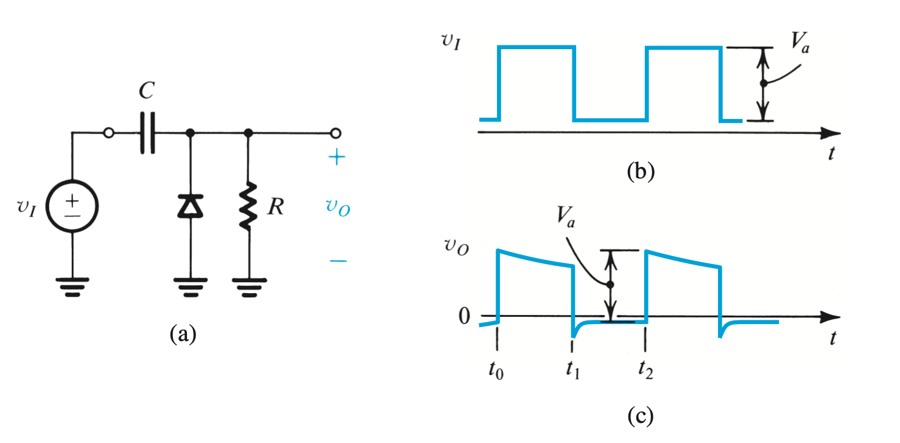

# Limiter/clipping and Clamping

---

### Limiting circuits

---

### Clamping or DC restorer

A "clamped capacitor" circuit:

Reversing the diode will output a a wavveform where the highest point is 0v

---

When a load resistance R is connected across the diode in a clamping circuit

For the output to be stable DC, the time to charge the capacitor must be much less than the time it takes to charge it

The total time for a capacitor to discharge is 5 time constants. 1 time constant is equal to $RC$

The time for the capacitor to charge is also 5 time constants, but it is charging through the didoe, so we must add the diode's internal resistance.

We need to solve $5\cdot R_L \cdot C >> 5\cdot R_D \cdot C$

##### part 1 - positve part of the sine wave

The load's resitance must be significantly large than the diode's resistance. (at least $100\times$)

The capacitor does not charge much when the diode is reverse biased because the current through $R_L$ is very small.

$\therefore$ the volatage across $R_L$ is going to be very close to the input voltage.

##### part 2 - negative part of the sine wave

The diode is forward biased and is a short, which gives the current a direct path to the negative terminal of the supply through the capacitor.

This quickly charges the capacitor because there is only the diode resistance in this path.

Meanwhile, the volatage across the parallel load is the same as the voltage drop across the diode. 

Assuming the capacitor is fully charged after this first negative half cycle (not realistic), it will be at the supply voltage minus the volatge drop of the diode.

the voltage will now oscillate with the capacitor's voltage as its middle point.

The new max is the supply volatge + the capacitor's voltage, and the new minimum is the capacitor's volatge - the supply volatage.

To make a negative clamper circuit, swap directin of diode, and capacitor if polarized

### Tips for solving

1. $V_C= V_in - v_D$

2. Max $V_o= V_C + \vert V_{in}\vert$

3. Min $V_0= V_C - \vert V_{in}\vert$
