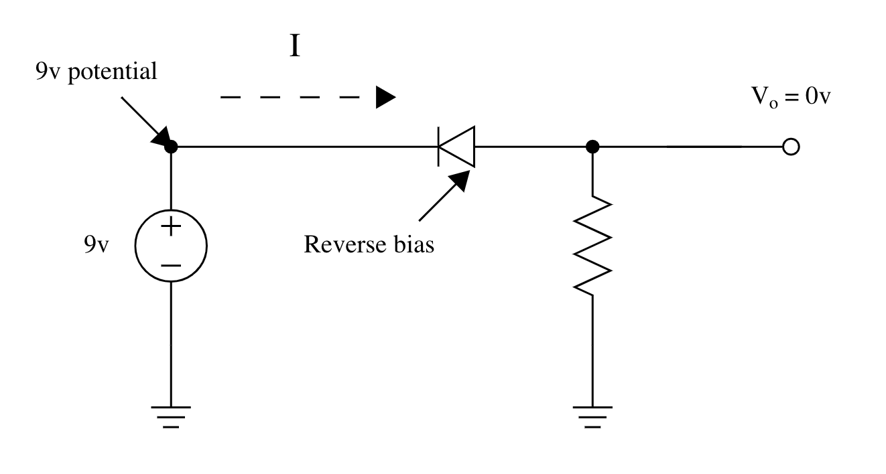
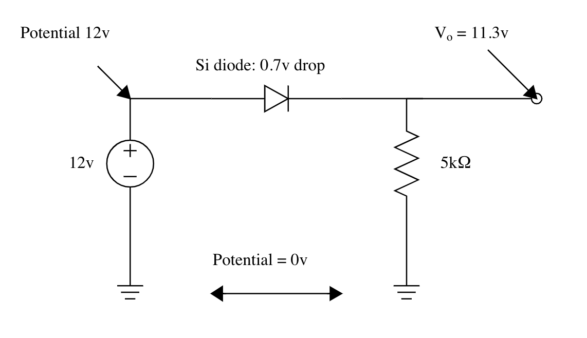

### Reverse Bias

When current is reversed, the component is a gap.

---

### Voltage Drop

current through resistor:

$I=\frac{V}{R} \quad \therefore \ I_{R1}= \dfrac{11.3v}{5k\Omega}=2.26mA$

---

