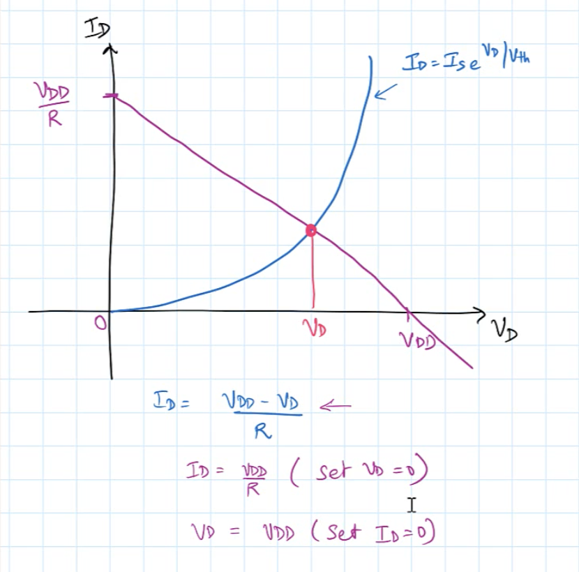
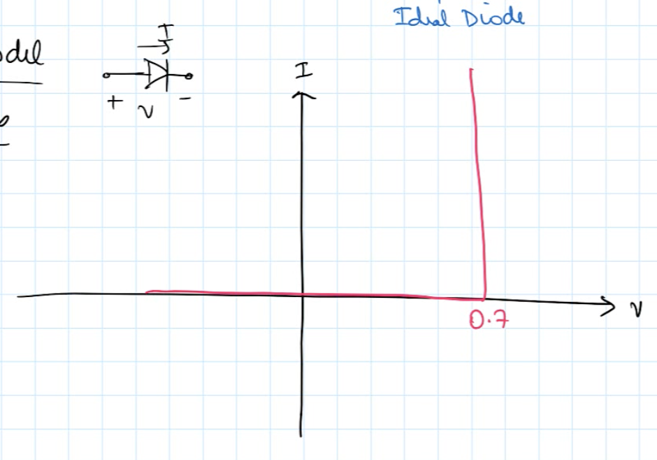
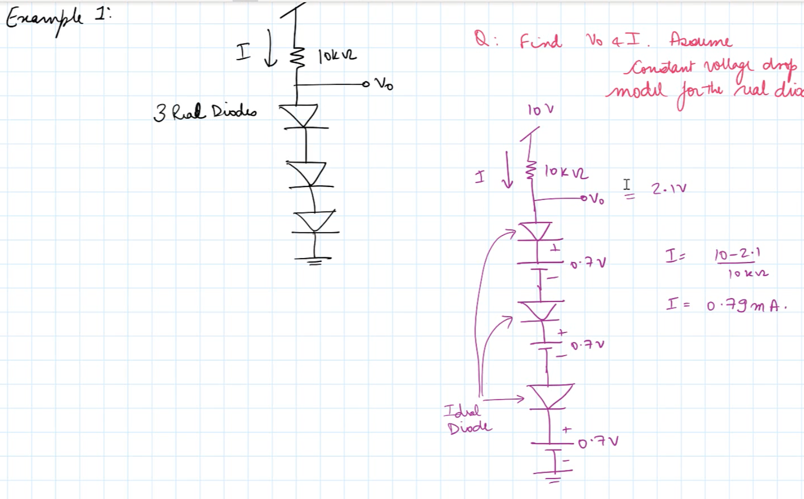

### Diode Materials
- N-material has free electrons
- P-material has room for them to move to 
- Where they meet is the depletion zone

---

#Bias

Biasing $\Longrightarrow$ applying voltage

- No voltage = no bias $\Longrightarrow$ no current flow
- positive voltage = forward bias $\Longrightarrow$ large current flow because depletion zone shrinks
- negative voltage = reverse bias $\Longrightarrow$ small reverse saturation current

$V_T$ = thermal voltage: approx 26mv at room temp

---

### IV graph:
- x-axis = voltage
- y-axis = current

---

$V_k$ = knee voltage: minimum voltage for conduction. where current spikes on IV graph

$V_b$ = voltage breakdown; when negative voltage overcomes depletion region and ruins diode

$V_b$ has a much greater magnitude than $V_k$

---
conduction
- **Forward Conduction**: When the forward voltage (typically around 0.7V for silicon diodes and 0.3V for germanium diodes) is applied, the diode enters conduction mode and current flows.  
- **Reverse Bias (Non-Conduction)**: When the diode is reverse-biased (anode connected to the negative terminal and cathode to the positive terminal), the diode ideally blocks current and does not conduct, except for a very small leakage current.  
- **Knee/Threshold Voltage**: The point at which the diode begins to conduct significantly in the forward direction is known as the **cut-in** or **threshold voltage** or **knee voltage**.  

---

| **Material** | $V_k$    | $V_b$     | 
| :----------- | :------: | :-------: |
| Silicon      | 0.7v     | -75v      | 
| Germanium    | 0.3v     | -50v      |
| GaAs         | 1.5v     | -100      |

---

### DC static resistance  
$R_D = \dfrac{V_D}{I_D}$
- Taken at a singular point on the IV graph.

---

### AC dynamic resistance:
$R_d = \dfrac{\Delta V_d}{\Delta I_d}$
- From the peak to the trough of a sine wave
$R_{d} = \dfrac{V_{peak} - V_{trough}}{I_{peak} - I_{trough}}$

---

### Average AC resistance

$R_{av}=\dfrac{\Delta V_d}{\Delta I_d} {\Large\vert}_{Point \ to \ Point}$

---

### Piecewise Linear Equivalent Circuit
In the real world we treat a diode as if it does not conduct at all until the knee voltage, where we assume a linear increase.

---

#### $I_0$

Changing the dark saturation current changes the turn on voltage of the diode. The ideality factor changes the shape of the diode.

Any physical effect that increases the ideality factor would substantially increase the dark saturation current, $I_0$, so that a device with a high ideality factor would typically have a lower turn on voltage.

---

### Transition Capacitance/Junction Capacitance

The depletion zone is a gap similar to the gap between capacitor plates.

When forward biased, there is no capacitance.

When reverse-biased there is capacitance

Wide depletion region = small capacitance
Narrow depletion region = large capacitance

$C_T = \dfrac{\Delta Q}{\Delta V}$

---

### Reverse Recovery time

There is a lag from when bias is switched from forward to reverse where the diode still conducts current.

Denoted as $t_{rr}$  

The "storage time", or the delay, is $t_s$: Amount of time the diode conducts reverse current

The transition time is $t_t$: Time it takes to ramp up/down in voltage after switching

and $t_{rr}=t_s+t_t$

--- 


# Lecture Wednesday

- $V_c$ = Cathode voltage with respect to ground
-$V_A$ = Anode voltage with respect to ground

Bias means applying a voltage 
- Forward, positive voltage applied to anode
- Reverse; negative voltage applied to anode

Current is a vector quantity

### Applications of diodes

- Voltage rectification; AC to DC
- Voltage clamping; Limits voltage spikes or ESD pulses
- DC restoration; Shifting DC square wave "up" so that minimum voltage is 0v

---

### Diode Circuits

A diode is on when:

- When a diode is on, $V_{anode} > V_{cathode}$
- Current is flowing in the direction from anode to cathode.

##### Solving:

- Make an assumption and test cases

- Remove diodes. If current can't flow, any resistors will not reduce voltage, so treat the end node where the diode was removed as if there were no resistors between it and the power source.

- Check node voltages, and also determine current direction.

- Abandon assumption of a system of diodes if one is a contradiction

- use KVL to determine voltage at node and current direction

- Use Kirchhoff's current law to determine current flowing in and out of nodes.

---

# 1/11/25 Video Lecture

Output from 2 parallel sources with diodes is the maxima of the two sources

### Real diodes

```
   i-->
o---|>---o
  +  v  -
```

##### Barrier potential

Forward bias Voltage above which we consider the diode to be "on". Turn on voltage.

Current that flows through when reverse biased is called "Saturation current" $I_S$
$I_S$ is very small: $10^{-15}$ to $10^{-16}$ amps.

##### Breakdown voltage

$V_BR=$ breakdown voltage. Reverse bias voltage which allows diode to break and allow current to flow unrestricted in reverse.

---

### Diode equation
$i=I_s\cdot(e^{\frac{V}{\eta\cdot V_{th}}}-1)$

- $v=$ voltage across diode
- $I_S=$ saturation current
- $\eta=$ constant $\approx 1$ for Si 
- $V_{th}$ Thermal voltage :
$v_{th}= \frac{K\cdot T}{q}$
where: $K=$ Boltzmann constant: $1.38\times 10^{-23}\frac{Joules}{Kelvin}$

$T=$ Room temperature in Kelvin: $K=273+^{\circ}C$,

and $q=$ charge of one electron ($e^-$)$=1.6\times10^{-19}$ coulombs 

For questions in this class: assume $V_{th}=25mV$ unless otherwise stated

In the diode equation, current is exponentially related to voltage

##### Forward bias
for forward bias, voltage across a diode is much more than zero 
$V >> 0$
So, the diode equation becomes $i=I_S\cdot(e^{\frac{V}{V_{th}}}-1) \ \because \eta =1$
Since $V>>0$, $e^{\frac{V}{V_{th}}}>>1$
$\therefore i=I_S\cdot e^{\frac{V}{V_{th}}}$

##### Reverse Bias

When reverse biased, the voltage is less than zero $V<0$
$\therefore e^{\frac{V}{V_{th}}} << 1$
$\because \frac{V}{V_{th}} \approx 0$
and $i$ simplifies to $i=-I_S$


#### Summation:

Forward bias: $i=I_S\cdot e^{\frac{V}{V_{th}}}$
Reverse Bias: $i=-I_S$

---

### Solving a real diode circuit

```
        R
     ---^v^v^----
     |           |  +     |
   + |         -----      | I_D
    ---         \ /       |
V_DD _           V  V_D   V
   - |          ---
     |___________|  -
```

#### Questions:
1. What is $V_{DD}$?
2. What is $I_D$?

Use the diode equation:

We know forward bias, $\therefore I_D=I_S\cdot e^{\frac{V}{V_{th}}}$  -Eqn.1
and per Ohm's law: $I_D=\frac{V_{DD}-V_D}{R}$     -Eqn.2

$V_D$ and $I_D$ are uknown, and we have the same number of equations.
Substitute Eqn.1 for $I_D$ in Eqn.2:
$I_S\cdot e^{\frac{V}{V_{th}}} =\frac{V_{DD}-V_D}{R} $

This is a non-linear equation, and is too hard to be solved by hand.

methods
 1. graphical method
 2. iterative method
 3. Constant voltage drop model
 4. SPICE

##### Graphical

- first point: set $V_D=0 \quad \Longrightarrow I_D=\frac{V_{DD}}{R}$
when $I_D$ is set to 0, $V_D=V_{DD}$


Solution is where lines intersect

This method is not effective for complex circuits

##### iterative

1. Assume inital voltage of the diode: $V_D=0.7v$

2. Solve for $I_D=\frac{V_{DD}-0.7}{R}$

3. For the $I_D$ from step 2, calculate $V_D$ again:
 $\because \ I_D=I_S\cdot e^{\frac{V}{V_{th}}}$:
 $V_D=V_{th}\cdot(ln \frac{I_D}{I_S})$

4. With new $V_D$, repeat from step 1.

After a number of iterations it will converge closer to the solution.

This is tedious work by hand, but works well as a computer algorithm.

##### Constant voltage drop model

Replace a real diode with a ideal diode in series with a $0.7v$ supply.


```
   i-->                    0.7v
o---|>---o   -->  o---|>---||---o
  +  v  -                 +  -
REAL                IDEAL
```

Concept: For an ideal to be on, anode voltage > cathode voltage
THis shows that for the didoe to be on the anode must be grater than the 0.7 v refverse supply
It mimics the barrier voltage of a real diode

IV characteristics:
No curve, jumps to full current at 0.7v

Good for hand calculations

95% acurate approximation

Does not work with reverse bias



---

# 1/13/25 Lecture

### Thermal volatge

$V_{th}$ effects the barrier volatge and the volatge drop

Diode as a temperature sensor: barrier voltage drops as temperature increases.

this will also affect the voltage drop.

we will be using the constant voltage drop model in this class.

constant volatge drop can e used to deisgn circuits, but then fine tune in SPICE

---

#### Example 1

```
3v
____
  |
  |
  <
  > 2k ohm
  >
  |---------Vo
  V
  -
  |
  V
... 5 total diodes
  |
  ___gnd
```

if all diodes are off, there is no voltage drop across resistor
$\therefore \ V_O = 3v$

if supply is 4v, all diodes are on and $V_O$ is 3.5v

---

## Voltage rectifiers

converting AC to DC

```
Input voltage -> transfprmer -> voltage rectifier -> filter -> voltage regulator -> device

```

Analog circuits need clean power supply

3 types of volatge recifier
1. Half wave recifier: affect half of the sine wave "fixes"
2. Full wave recifier: fixes full sine wave
3. Bridge rectifier: 

#### half wave

1 diode on secondary side

grounds on transformer can be physiccally seperated

```
__n__n__n__
````

all volatage droops across load

New half wave has peak of:
$8 \cdot \sqrt{2}$

when in the negative part of original sine wave, diode is off and $V_O$ is zero.

PIV: peak inverse voltage:
Maximum reverse bias voltage that appears across a diode in a circuit.

PIV for half wave rectifier is 
$8 \cdot \sqrt{2}$

when designing circuit, make sure breakdown voltage is well above PIV

average voltage od a sine wave is zero.
average of a half wave is non zero, therefore it has some DC content (voltage)


using a capacitor across the load creates a filter

during first half of cycle we are charging the capacitor

capaictor release charge during second half which turns diode off

size of capacitor changes ammount of ripple to load

full wave rectification is easier to filter than a half wave

see half wave LTSPICE simulation on canvas

current across capacitor changes instantaneously, but volatge can't. Opposite for inductors


---

# Lecture 1/15/25

# Voltage rectification contd

$\tao =rc$
$\omega_p=\frac{1}{rc}$

### Full wave rectifiers

### Bridge rectifier

Using more diodes to avoid needing a center tap

Ground is a low impedance point

Ground does not have to be the lowest potential in a circuit

$v=\frac{L_{di}}{d_t}$

