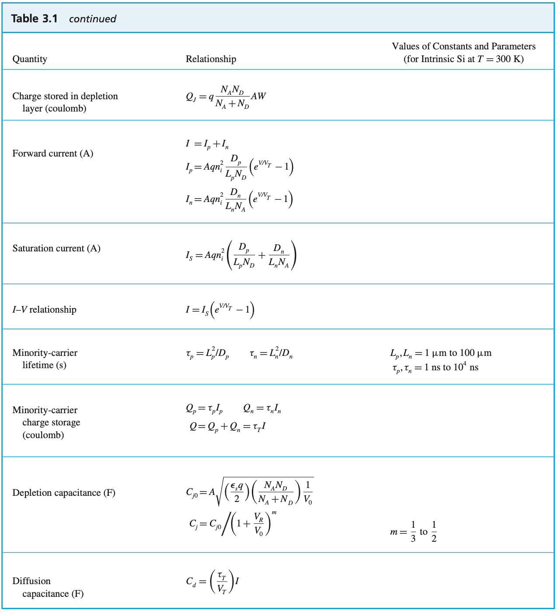
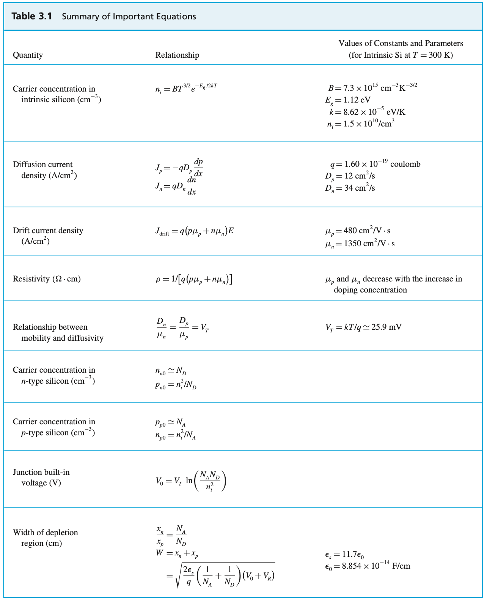
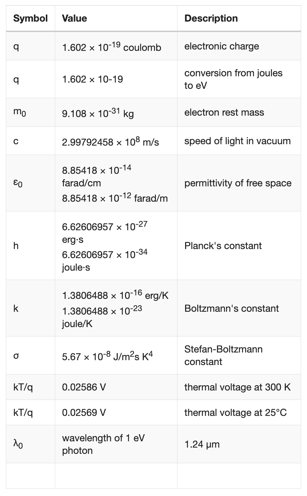

---

## Diode Constants:

---

## Ideal Diode Law:

$I=I_0(e^{\frac{qV}{kT}}-1)$

#### where:
I = the net current flowing through the diode;

- $I_0$ = "dark saturation current", the diode leakage current density in the absence of light;
- $V$ = applied voltage across the terminals of the diode;
- $q$ = absolute value of electron charge;
- $k$ = Boltzmann's constant; and
- $T$ = absolute temperature ($K$)

The "dark saturation current" ($I_0$) is an extremely important parameter which differentiates one diode from another. $I_0$ is a measure of the recombination in a device. A diode with a larger recombination will have a larger $I_0$. An excellent discussion of the recombination parameter is in

##### Note that:
- $I_0$ increases as $T$ increases
- $I_0$ decreases as material quality increases.

---

## Non-Ideal Diodes

For real-world diodes, the expression becomes:

$I= I_0(e^{\frac{qv}{nkT}}-1)$

#### where:
$n$ = ideality factor, a number between 1 and 2 which typically increases as the current decreases.

---

### Transition Capacitance/Junction Capacitance

$C_T = \dfrac{\Delta Q}{\Delta V}$

---

### Reverse Recovery Time

$t_{rr}=t_s+t_t$

##### where:

- $t_s$ = storage time
- $t_t$ = transition time

---

### Transistor currents

- $I_B$ : Base current
- $I_C$ : Collector current
- $I_E$ : Emitter current
- $\beta$ : Transistor current gain

$I_B = \dfrac{I_C}{\beta}$

$I_C = \beta \cdot I_B$

$I_E = I_C + I_B$

$\beta = \dfrac{I_C}{I_B}$

